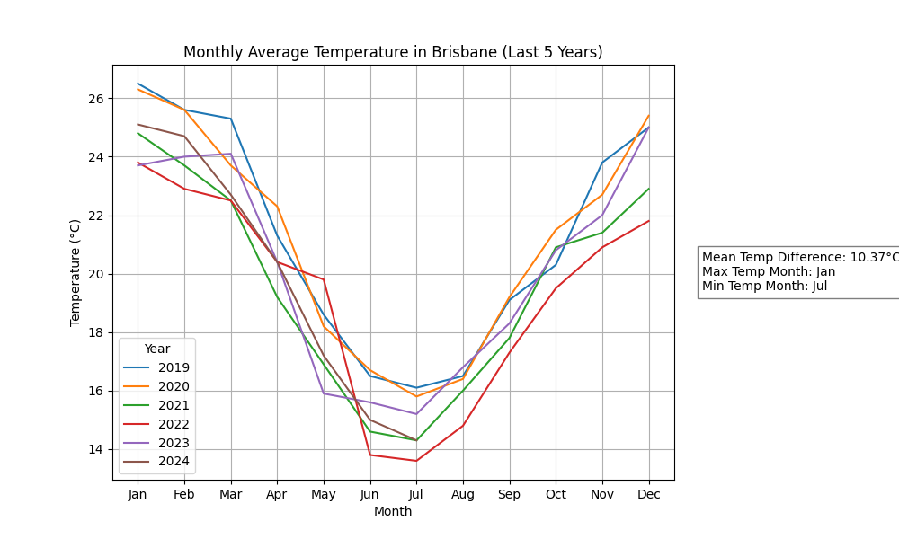
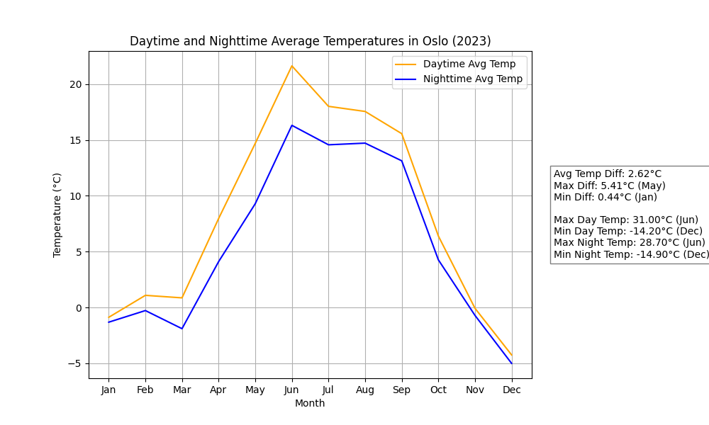
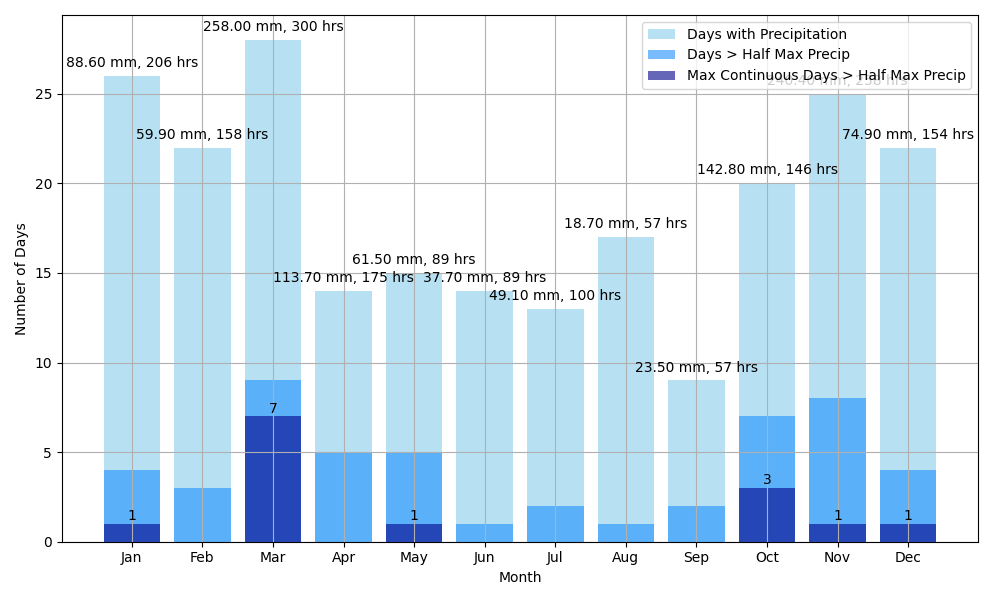
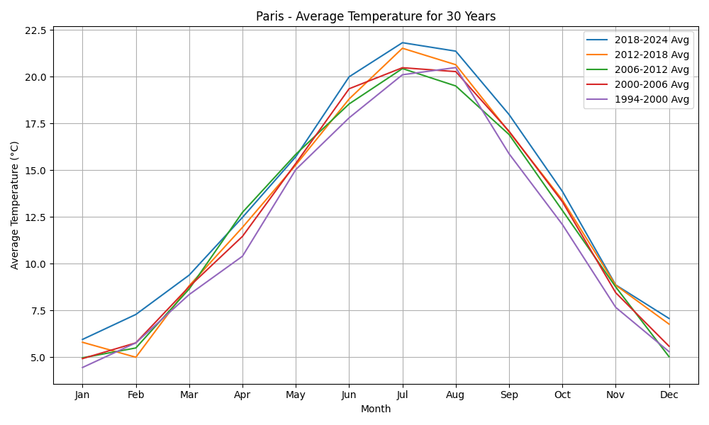

# Weather Analysis Programs

This repository contains four Python programs designed to analyze weather data using the Meteostat API. Each program is specialized to perform different weather-related analyses, including temperature trends, precipitation patterns, and more.

## Programs

### 1. **FiveYearTemp**
- **Description**: 
  This program shows 5 years of temperature data for a selected city. It plots the average monthly temperature over these years.
  
- **Usage**:
  - When running the program, the user selects a city from the provided list.
  - The program fetches temperature data for the last 5 years and generates a graph showing the monthly average temperatures for each year.

- **Input**:
  - City Selection.
  
- **Output**:
  - A plot with 5 lines, each representing a year of average monthly temperature data.



---

### 2. **DayNightTemperature**
- **Description**: 
  This program analyzes hourly weather data for a selected year. It displays a graph shows average day and night temperatures.


- **Usage**:
  - The user selects a city and a year.
  - The program retrieves temperature .

- **Input**:
  - City Selection.
  - Year Selection.

- **Output**:
  - Graph of Monthly average day and night temperatures




---

### 3. **Precipation**
- **Description**: 
  This program focuses on analyzing precipitation data. It generates a graph showing:
  1. The number of days with precipitation.
  2. The number of days with precipitation above half the maximum.
  3. The maximum number of continuous days with precipitation above half the maximum.

- **Usage**:
  - The user selects a city and a year.
  - The program retrieves precipitation data for the selected year and generates the corresponding graph.

- **Input**:
  - City Selection.
  - Year Selection.

- **Output**:
  - A graph showing precipitation statistics, including total precipitation in mm and the number of hours with rain per month.



---

### 4. **LongTemp**
- **Description**: 
  This program allows the user to select how many years (between 1 and 10) to average temperature data. It generates 5 graphs, each showing the average temperature over the selected span, with the total timespan equaling 5 times the chosen average span.

- **Usage**:
  - The user selects a city and specifies how many years to average (between 1 and 10).
  - The program fetches the temperature data and generates 5 graphs showing the average temperature for each time span.

- **Input**:
  - City Selection.
  - Years to Average (1-10).

- **Output**:
  - 5 graphs showing the average temperature for the specified range of years.



---

## Requirements

- Python 3.x   (Version 3.12 was used)
- Libraries:
  - `pandas`
  - `matplotlib`
  - `meteostat`

To install the required libraries, use the following command:

```bash
pip install pandas matplotlib meteostat
```

## Disclaimer

The code here has been generated using ChatGPT 4o, iterating multiple times, refining the prompts in order to fix errors and add improvements.  

It may be correct.
